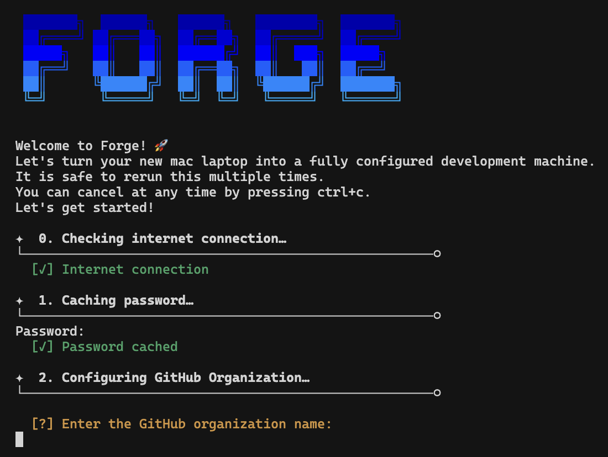

# Forge

> Forge turns your macOS laptop into a fully functional development machine in a single command.

It can be run multiple times on the same machine safely.
It installs, upgrades, or skips packages based on what is already installed on the machine.



## Install

You can install Forge using one of these two methods:

### Option 1: Direct Install (Recommended)

Run this single command in your terminal:

```sh
curl -L https://raw.githubusercontent.com/yosefserkez/forge/main/install.sh | bash
```

### Option 2: Manual Install

If you prefer to review the code first:

1. Download the repo:

```sh
git clone https://github.com/yosefserkez/forge.git && cd forge
```

2. Review the scripts:

```sh
less setup.sh
```

3. Run the setup:

```sh
./setup.sh 2>&1 | tee ~/forge.log
```

Just follow the prompts and you'll be fine. 👌

## What it sets up

The setup process will install and configure the following tools and applications.
All packages are managed through Homebrew and defined in [`configs/Brewfile`](configs/Brewfile).

### Command Line Tools

- [XCode Command Line Tools](https://developer.apple.com/xcode/downloads/) for developer essentials
- [Git](https://git-scm.com/) for version control
- [Homebrew](http://brew.sh/) for managing operating system libraries
- [ZSH](https://www.zsh.org/) with [Oh My Zsh](https://ohmyz.sh/) for a better shell experience
- [coreutils](https://www.gnu.org/software/coreutils/) for GNU file, shell and text manipulation utilities
- [curl](https://curl.se/) and [wget](https://www.gnu.org/software/wget/) for downloading files
- [fzf](https://github.com/junegunn/fzf) for command-line fuzzy finding
- [jq](https://stedolan.github.io/jq/) for JSON processing
- [btop](https://github.com/aristocratos/btop) for system resource monitoring
- [fastfetch](https://github.com/fastfetch-cli/fastfetch) for system information display
- [ffmpeg](https://ffmpeg.org/) for video processing
- [gh](https://cli.github.com/) for GitHub CLI integration
- [libyaml](https://pyyaml.org/wiki/LibYAML) for YAML parsing

### Development Environment

- [Cursor](https://cursor.sh/) - AI-powered code editor
- [Neovim](https://neovim.io/) with [LazyVim](https://www.lazyvim.org/) - Modern Vim-based editor
- [Zed](https://zed.dev/) - High-performance code editor
- [Ghostty](https://github.com/mitchellh/ghostty) - Modern terminal emulator
- [Docker](https://www.docker.com/) for containerization
- [OrbStack](https://orbstack.dev/) for Docker and Linux development on macOS
- [PostgreSQL 17](https://www.postgresql.org/) with `libpq` for database management
- [Redis](https://redis.io/) for in-memory data store
- [jemalloc](https://jemalloc.net/) for memory allocation
- [vips](https://www.libvips.org/) for image processing (automatically installs configured runtimes if `~/.mise.toml` exists)
- [Ollama](https://ollama.ai/) for local AI models
- [Overmind](https://github.com/DarthSim/overmind) for process management
- [Mise](https://mise.jdx.dev/) for runtime version management. The Mise configuration is present in [mise.toml](configs/mise.toml). It is configured to work with `.nvmrc` for backward compatability.
  It installs:
  - Python
  - Ruby
  - Rust
  - Go
  - Node
    > **mise** replaces multiple development tools, including version managers like asdf, nvm, and pyenv, the environment manager direnv, and task runners such as make and npm scripts. It unifies these functions into a single tool that can manage and switch between different versions of programming languages.
- [UV](https://github.com/astral-sh/uv) for Python packaging
- [pnpm](https://pnpm.io/) for Node.js package management
- [yarn](https://yarnpkg.com/) for Node.js package management
- [Vercel CLI](https://vercel.com/cli) for Vercel deployment and management
- [AWS CLI](https://aws.amazon.com/cli/) for Amazon Web Services management (configured via `scripts/aws.sh`)
- Repository cloning for required development repositories (configured via `scripts/repos.sh`)

### Productivity & Communication

- [1Password](https://1password.com/) for password management
- [Arc](https://arc.net/) - Modern web browser
- [Brave Browser](https://brave.com/) for web browsing
- [ChatGPT](https://chat.openai.com/) for AI assistance
- [Claude](https://claude.ai/) for AI assistance
- [Claude Code](https://claude.ai/code) for AI-powered code assistance
- [Dia](https://www.diabrowser.com/) - AI browser from the makers of Arc
- [Discord](https://discord.com/) for communication
- [Figma](https://www.figma.com/) for design and prototyping
- [IINA](https://iina.io/) for media playback
- [iTerm2](https://iterm2.com/) for terminal emulation
- [LocalSend](https://localsend.org/) for cross-platform file sharing
- [Loom](https://www.loom.com/) for video messaging
- [NetNewsWire](https://netnewswire.com/) for RSS reading
- [Notion](https://www.notion.so/) for note-taking and workspace
- [Obsidian](https://obsidian.md/) for note-taking
- [OpenVPN Connect](https://openvpn.net/client-connect-vpn-for-mac-os/) for VPN connectivity
- [PearCleaner](https://www.pearcleaner.com/) for app uninstallation
- [Raycast](https://www.raycast.com/) for productivity launcher
- [Rectangle](https://rectangleapp.com/) for window management
- [Slack](https://slack.com/) for team communication
- [SuperWhisper](https://superwhisper.com/) for voice transcription
- [Zoom](https://zoom.us/) for video conferencing

### Fonts

- Cascadia Code
- Cascadia Mono
- Commit Mono
- DM Sans
- Fira Code
- Geist
- Geist Mono
- Google Sans Code
- Hack
- IBM Plex Mono
- IBM Plex Sans
- Work Sans

### Enhanced macOS Settings

The setup applies developer-optimized macOS configurations including:

- **Performance**: Near-instant window animations and faster Mission Control
- **Finder**: Opens to home directory, searches current folder by default, shows hidden files
- **Text Editing**: Key repeat enabled in all apps, faster cursor movement
- **Screenshots**: Organized in `~/Desktop/Screenshots/` folder without shadows
- **Trackpad**: Three-finger drag enabled for better window management
- **Keyboard**: Fastest repeat rates for efficient coding
- **System**: Disabled automatic corrections, expanded dialogs, local saves by default

## Features

### Modular Scripts

Each script in the [`scripts/`](scripts/) directory can be run independently:

```sh
# Run individual scripts
./scripts/mac.sh       # Only configure macOS settings
./scripts/git.sh       # Only setup Git configuration
./scripts/cursor.sh    # Only configure Cursor editor
./scripts/nvim.sh      # Only configure Neovim with LazyVim
./scripts/zed.sh       # Only configure Zed editor
./scripts/mise.sh      # Only setup mise and install configured runtimes
./scripts/zshrc.sh     # Only setup Zsh configuration
./scripts/ssh.sh       # Only configure SSH settings
./scripts/aws.sh       # Only configure AWS CLI
./scripts/repos.sh     # Only clone selected repositories
./scripts/bookmarks.sh # Only import bookmarks into browsers
```

The scripts are designed to be:

- **Independent**: Each script can run on its own
- **Idempotent**: Safe to run multiple times
- **Configurable**: Easy to modify for your needs

### AWS Configuration

The `scripts/aws.sh` script sets up AWS CLI configuration:

- Creates `~/.aws` directory with proper permissions
- Copies AWS config from `configs/aws/config` to `~/.aws/config`
- Prompts for AWS credentials (Access Key ID and Secret Access Key) via `aws configure`
- Handles existing configurations gracefully with override prompts

### Repository Setup

The `scripts/repos.sh` script guides you through cloning available repositories from the selected GitHub organization:

- Prompts for GitHub organization name during setup (or accepts it as a command line argument)
- Fetches all available repositories from the GitHub organization using GitHub CLI
- Provides an interactive selection interface to choose which repositories to clone:
- Clones selected repositories into `~/{ORGANIZATION}/`
- Skips repositories that already exist locally

**Requirements:**

- GitHub CLI (`gh`) must be installed and authenticated
- Run `gh auth login` if you haven't authenticated yet

You can also run the script independently with a GitHub organization as an argument:

```sh
./scripts/repos.sh your-github-org
```

### Bookmarks Setup

The `scripts/bookmarks.sh` script automatically imports some common websites as bookmarks into your browsers from `configs/bookmarks.json`.

**Supported Browsers:**

- **Safari**: Automatically imports bookmarks (requires Full Disk Access)
- **Chrome**: Automatically imports bookmarks
- **Brave**: Automatically imports bookmarks
- **Arc**: Shows instructions to use browser's import feature
- **Dia**: Shows instructions to use browser's import feature

**How to Enable:**

1. Open `setup.sh` and change the `SETUP_BOOKMARKS` variable from `false` to `true`:

   ```sh
   SETUP_BOOKMARKS=true
   ```

2. Optionally configure the bookmarks in `configs/bookmarks.json`:

3. Run the setup script. The bookmarks will be automatically imported into all detected browsers.

You can also run the bookmarks script independently:

```sh
./scripts/bookmarks.sh
```

## Code Structure

The project follows a modular structure where each component is responsible for a specific setup task. You can run any script individually if you only want to set up specific parts of your system.

```
forge/
├── setup.sh                 # Main setup script
├── scripts/
│   ├── ascii.sh            # ASCII art for terminal output
│   ├── aws.sh              # AWS CLI configuration
│   ├── bookmarks.sh        # Browser bookmarks import
│   ├── brew.sh             # Homebrew package installation
│   ├── cursor.sh           # Cursor editor configuration
│   ├── gemrc.sh            # Gem configuration
│   ├── ghostty.sh          # Ghostty terminal configuration
│   ├── git.sh              # Git configuration
│   ├── irbrc.sh            # IRB configuration
│   ├── mac.sh              # macOS system preferences
│   ├── mise.sh             # Mise runtime manager setup
│   ├── nvim.sh             # Neovim configuration
│   ├── repos.sh            # Repository cloning
│   ├── ssh.sh              # SSH configuration
│   ├── utils.sh            # Utility functions
│   ├── zed.sh              # Zed editor configuration
│   ├── zsh.sh              # ZSH shell setup
│   └── zshrc.sh            # Zshrc configuration
├── configs/
│   ├── aws/                # AWS configuration files
│   ├── bookmarks.json      # Browser bookmarks configuration
│   ├── Brewfile            # Homebrew packages list
│   ├── cursor/             # Cursor editor settings
│   ├── git/                # Git configuration files
│   ├── nvim/               # Neovim configuration with
│   ├── mise.toml          # Mise runtime versions config
│   └── zshrc              # Zsh shell configuration
 LazyVim
│   ├── ssh/                # SSH configuration files
│   ├── zed/                # Zed editor settings
│   ├── gemrc              # Ruby gems configuration
│   ├── ghostty.conf       # Ghostty terminal config
│   ├── irbrc              # IRB (Interactive Ruby)
└── README.md
```

### Configuration Files

The [`configs/`](configs/) directory contains all config files.

## Customization

The script is designed to be customizable. You can:

- Modify the [`Brewfile`](configs/Brewfile) to add/remove packages
- Adjust macOS settings in [`scripts/mac.sh`](scripts/mac.sh)
- Modify the configuration files in [`configs/`](configs/) directory

## Acknowledgements

Forge is inspired by Basecamp's [Omakub](https://github.com/basecamp/omakub) project and forked from [omakos](https://github.com/yatish27/omakos).
